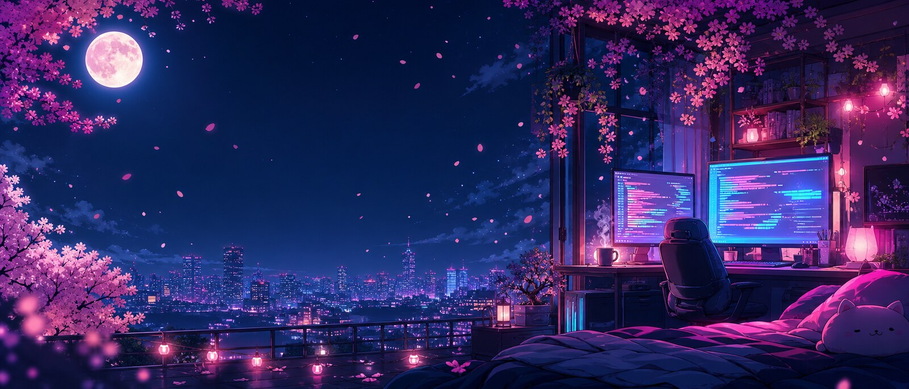
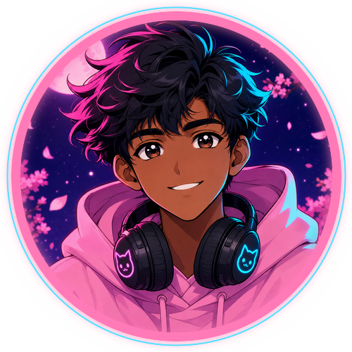
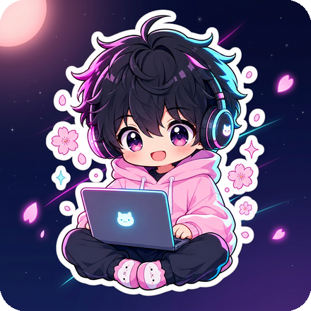

<!-- ✿ sakura-at-night ✿ palette: sakura #FF7AB6 · neon cyan #5BE1FF · violet #A78BFA · night #161027
     this repo (DarkLegendHyper/DarkLegendHyper) renders at https://github.com/DarkLegendHyper
     art in assets/ : banner.jpg · avatar.png · mascot.png · divider.png
     widgets are third-party SVGs (github-readme-stats family, shields, komarev) - no build step -->

<div align="center">
  
</div>

<h1 align="center">˖ ° ✧ ᴅ ꜱ ꜱ · K A R U N A R A T H N A ✧ ° ˖</h1>

<h3 align="center">❀ <b>DarkHYPER</b> — anime-shaped brain, neon-tinted keyboard ❀</h3>

<p align="center">
  
</p>

<p align="center">
  
  
  
  
  
</p>

<p align="center"></p>

<h2 align="center">👁️🗨️ &nbsp;About&nbsp;me&nbsp; ˖ ° ✧</h2>

<p align="center">
  &nbsp;&nbsp;
  
</p>

```js
// ~/anuradhapura/night-shift/profile.js  ·  refreshed 2026.09
const me = {
  handle: "DarkHYPER",                                // github.com/DarkLegendHyper
  name: "D.S.S. Karunarathna",                        // he / him
  class: "Frontend Mage ⚡",                          // Vue · Nuxt · React · Tailwind
  side: "Bot Smith 🌙",                               // Baileys + Gemini API bots
  locale: "Anuradhapura, Sri Lanka 🇱🇰",               // UTC+05:30 · moon hours
  hobbies: "programming, reading, gaming, music",     // all after midnight
  vibe: "cute on the surface, neon in the terminal",  
  sleep: false,                                       // reclaimed by the compiler
};
```

> [!NOTE]
> **whoami → normal person, extra carefully.** I build things at night, break them politely, then ship
> the fix before sunrise ⋆｡ ✧ New for 2026: **SakuraMD-Media** 🌸 and voice replies for my bots.

<p align="center"></p>

<h2 align="center">⚡ &nbsp;The&nbsp;Arsenal&nbsp; (˵•̀ᴗ-́˵)✧</h2>

<p align="center">
  <b>✦ frontend</b><br/>
       
       
</p>

<p align="center">
  <b>✦ backend &amp; apps</b><br/>
       
      
</p>

<p align="center">
  <b>✦ languages</b><br/>
       
  
</p>

<p align="center">
  <b>✦ tools &amp; deploy</b><br/>
       
</p>

<p align="center">
  <b>✦ exploring in 2026</b> &middot; <i>learning out loud, PRs welcome</i><br/>
       
</p>

<p align="center"></p>

<h2 align="center">🌸 &nbsp;2026&nbsp;build&nbsp;log&nbsp; ❀</h2>

| repo | what it is | live stats |
|:--|:--|:--|
| 🌸 **SakuraMD-Media** | new this week — media + markdown playground, still blooming | <a href="https://github.com/DarkLegendHyper/SakuraMD-Media"> </a> |
| 🎤 **VoiceReply-Bot** | JS bot that listens, then answers out loud | <a href="https://github.com/DarkLegendHyper/VoiceReply-Bot"> </a> |
| ✨ **Gemini-Ai** | chat bot on Google's Gemini Pro API — answers, code, ideas | <a href="https://github.com/DarkLegendHyper/Gemini-Ai"> </a> |
| 💫 **A17** | WhatsApp multi-device bot built on Miku + Baileys | <a href="https://github.com/DarkLegendHyper/A17"> </a> |
| ˖ ° **this profile** | the repo you're reading right now | <a href="https://github.com/DarkLegendHyper/DarkLegendHyper"></a> |

<sub>badge numbers come straight from the GitHub API, so this table never goes stale ˗ˏˋ ♡ ˎˊ</sub>

<p align="center"></p>

<h2 align="center">⛩️ &nbsp;Side&nbsp;quests&nbsp; ( ˘ ³˘)♥</h2>

```text
┌─ 2026 · status ─────────────────────────────────┐
  now playing : lo-fi + anime OSTs 🎧              
  current arc : SakuraMD-Media 🌸 (new this week)  
  rewatching  : whatever is on at 2am              
  reading     : one more chapter 📚                
  gaming      : ranked? never heard of it          
  goal        : ship → sleep → ship again          
└─────────────────────────────────────────────────┘
```

<p align="center">
  
  
  
  
</p>

> [!TIP]
> My signature, kept on purpose:
>
> ```text
> “the best way to recognize me
>  is by trying to forget your
>  impressions about me”
> ```

<details>
<summary>˖ ° fun facts &amp; the kaomoji hoard (click to bloom)</summary>

<br/>

- I learn a stack by shipping a bot at 1am, not by watching a 9-hour course 🌙
- Commit messages are documentation; documentation is a love letter to future me.
- Colour theory I trust: sakura pink + cyan on deep navy. That is the entire brand.
- Rotation: ` (｡•ᴗ-)_ ` ` ʕ•ᴥ•ʔ ` ` (ノ◕ヮ◕)ノ*:・゚✧ ` ` ¯\_(ツ)_/¯ ` ` (⁄ ⁄>⁄ ▽ ⁄<⁄ ⁄) `
- Sri Lankan flag colours sneak into every palette I make: teal + gold ✨
- This profile README is my favourite repo: 0 dependencies, 100% vibes.

</details>

<p align="center"></p>

<h2 align="center">📊 &nbsp;GitHub&nbsp;constellation&nbsp; ✧･ﾟ</h2>

<p align="center">
  &nbsp;
  
</p>

<p align="center">
  
</p>

<p align="center">
  
</p>

<p align="center">
  
</p>

<p align="center"></p>

<h2 align="center">📬 &nbsp;Ping&nbsp;me&nbsp; (˵◕ᴗ•˵)♡</h2>

<p align="center">
  <a href="https://github.com/DarkLegendHyper"></a>
  <a href="https://github.com/DarkLegendHyper?tab=repositories"></a>
  <a href="https://github.com/DarkLegendHyper?tab=followers"></a>
  <a href="https://github.com/DarkLegendHyper/SakuraMD-Media"></a>
</p>

<p align="center">˖ ° ✧ <b>made in Anuradhapura with ♡, strong milk tea and far too many anime OSTs</b> ✧ ° ˖</p>

<p align="center"><sub>sakura-at-night build &middot; 2026.09 &middot; <code> ˗ˏˋ ♡ ˎˊ </code> thanks for scrolling</sub></p>

<p align="center"></p>

<!-- to refresh: edit README.md + assets/ in this repo.
     matching account avatar: assets/avatar-profile.jpg (set it in GitHub > Settings > Profile > Picture) -->
